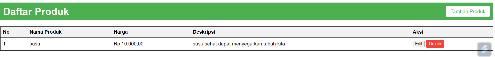

# simple list produk
Simple List Produk dengan CRUD SQLite adalah sistem daftar produk yang mengintegrasikan fitur Create, Read, Update, dan Delete (CRUD) dengan menggunakan SQLite sebagai basis datanya. 

fitur :
- Create (Tambah Produk)
- Read (Tampilkan Produk)
- Update (Edit Produk)
- Delete (Hapus Produk)

